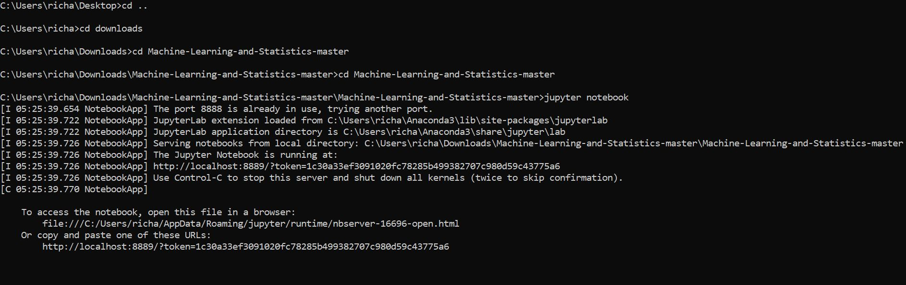

<h1 align ="center">Boston House Prices Data Set</h1>

<h2 align ="center">Machine Learning and Statistics Project 2019</h2>
<h2 align ="center">Created by Richard Feeney</h2>
 

# Introduction

### Iris Data Set Project Outline And Objectives

 The following project is based on the well-known Boston House Prices data set. Every record in the database describes a Boston suburb or town. The data was drawn from the Boston Standard Metropolitan Statistical Area (SMSA) in 1970. 

In this project I will use a .csv file for researching and explaining what the data set is all about and write some Python scripts using the Jupyter along with other packages to backup my findings. This project will be broken down into three parts and these are as follows
 

1. <b><i>Description</i></b>: Create a git repository and make it available to view online via GitHub. Within the repository, create a Jupyter notebook that uses descriptive statistics and plots to describe the dataset.  
2. <b><i>Infer</i></b>: Add a section where I will use inferential
statistics to analyse whether there is a significant difference in median house prices between houses that are along the Charles river and those that aren’t.   
3. <b><i>Predict</i></b>: Use keras to create a neural network
that can predict the median house price based on the other variables in the dataset.

  

### How To Run The Boston House Prices Dataset

1. Download Cmder command line or use the command line on your computer.  
2. Go to Github, find my repository or use the following link https://github.com/richardfeeney7/Machine-Learning-and-Statistics.git. Click on the Clone/Download button and select download zip.   
3. Once downloaded go to the command line and navigate to this  download using the cd command. When I download the zip file, I first had to unzip it and cd into it, and within that folder I had another folder that I need to cd into also.  
4. Once in the correct location type Jupyter Lab or Jupyter Notebook into the command like. This will open a web server where you can access the files. Depending on the settings this might open Internet Explorer, I would recommend closing that web page and use the web address that you can see in the command line.   
5. When you open the web server and can view my project file, open the <u><b><i>.ipynb</i></b></u> document to view the project.   
6. See the below photo of steps that I took, please note that your machine and downloads might be in a different location. 
  

